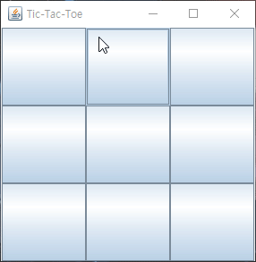
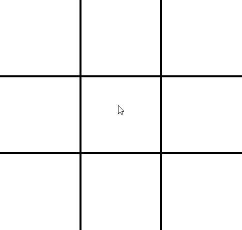
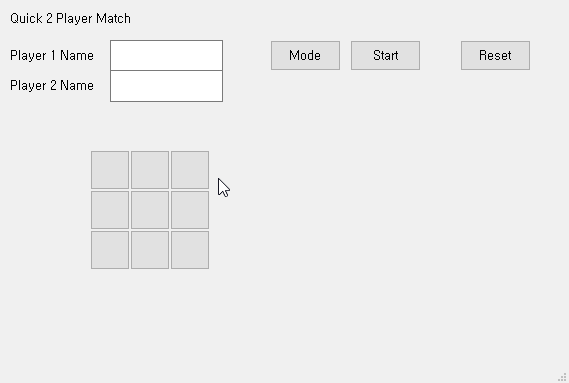

# Projects 2

## **[GUI]** 틱택톡

### **[필수]** 다음과 같이 틱택톡 게임을 할 수 있는 프로그램을 만드시오. (사람 대 사람)

- 틱택톡 게임에 대한 설명은 다음 링크를 참조합니다.

  - https://ko.wikipedia.org/wiki/%ED%8B%B1%ED%83%9D%ED%86%A0

#### 힌트 

- `C++` 추천 예제 

  - https://doc.qt.io/qt-5/qtwidgets-widgets-calculator-example.html

  - https://doc.qt.io/qt-5/qtwidgets-widgets-groupbox-example.html

  - https://doc.qt.io/qt-5/qtwidgets-widgets-tetrix-example.html

  - https://doc.qt.io/qt-5/qtwidgets-widgets-windowflags-example.html

  - _모든 예제는 여기(https://doc.qt.io/qt-5/examples-widgets.html)에 있습니다._

- `Java` 추천 예제 

  - http://zetcode.com/tutorials/javaswingtutorial/basicswingcomponents/

  - http://zetcode.com/tutorials/javaswingtutorial/basicswingcomponentsII/

  - _모든 예제는 **Helpful link** 에서 찾을 수 있습니다._

- **[java]** 틱택톡 완성 예시 1

  

  - 틱택톡을 만들기 위해 사용된 주된 컴포넌트 : `Jbutton`

  - 사용된 레이아웃 : `GridLayout`

- **[java]** 틱택톡 완성 예시 2

  

  - 틱택톡을 만들기 위해 사용된 주된 컴포넌트 : `paintComponent`

- **[c++]** 틱택톡 완성 예시 3

  

  - 틱택톡을 만들기 위해 사용된 주된 컴포넌트 : `QToolButton`

  - 텍스트를 입력 받기 위해 사용된 컴포넌트 : `QLineEdit`

  - `Player 1 Name` 의 컴포넌트 : `QLabel`

  - `Mode`, `Start`, `Reset` 버튼의 컴포넌트 : `QPushButton`

### **[선택]** 다음과 같이 틱택톡 게임을 할 수 있는 프로그램을 만드시오. (사람 대 컴퓨터)

  - 컴퓨터의 지능은 인공지능급으로 안 해도 되고 틱택톡을 랜덤으로 선택할 수 있게 해도 됩니다. 

  - 랜덤값을 구현하셨으면은 이기는 전략을 규칙으로 만들어서 컴퓨터 플레이어를 만들어보세요. 
