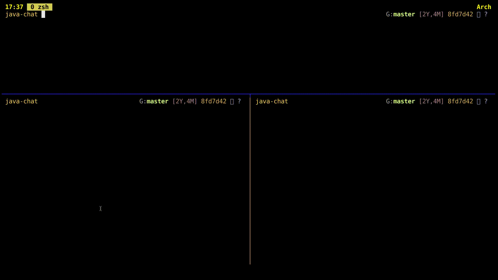
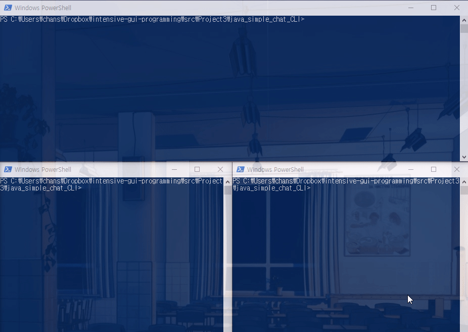
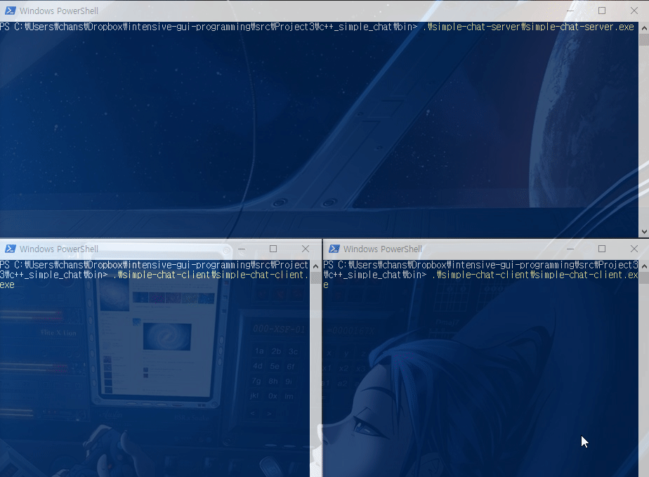
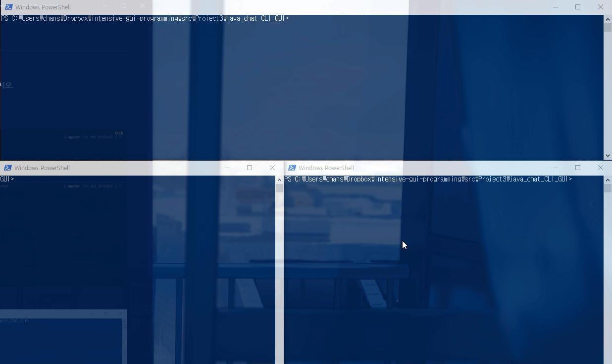
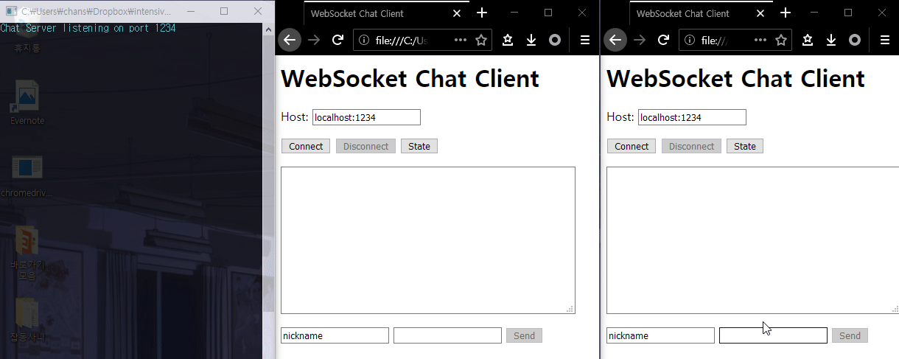
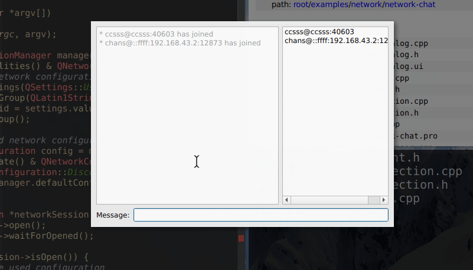

# Projects 3

## 채팅 프로그램 

### **[필수]** **CLI** 로 채팅할 수 있는 할 수 있는 프로그램을 만드시오.

#### 힌트 

- **[java]** `CLI` 채팅 프로그램1

  

- **[java]** `CLI` 채팅 프로그램2

  

- **[C++]** `CLI` 채팅 프로그램1

  

### **[필수]** 다음과 같이 **GUI** 로 채팅할 수 있는 할 수 있는 프로그램을 만드시오.

- **[java]** `GUI` 채팅 프로그램

  

- **[C++]** `GUI` 채팅 프로그램

  

- **[C++]** `GUI` 채팅 프로그램2

  

  
